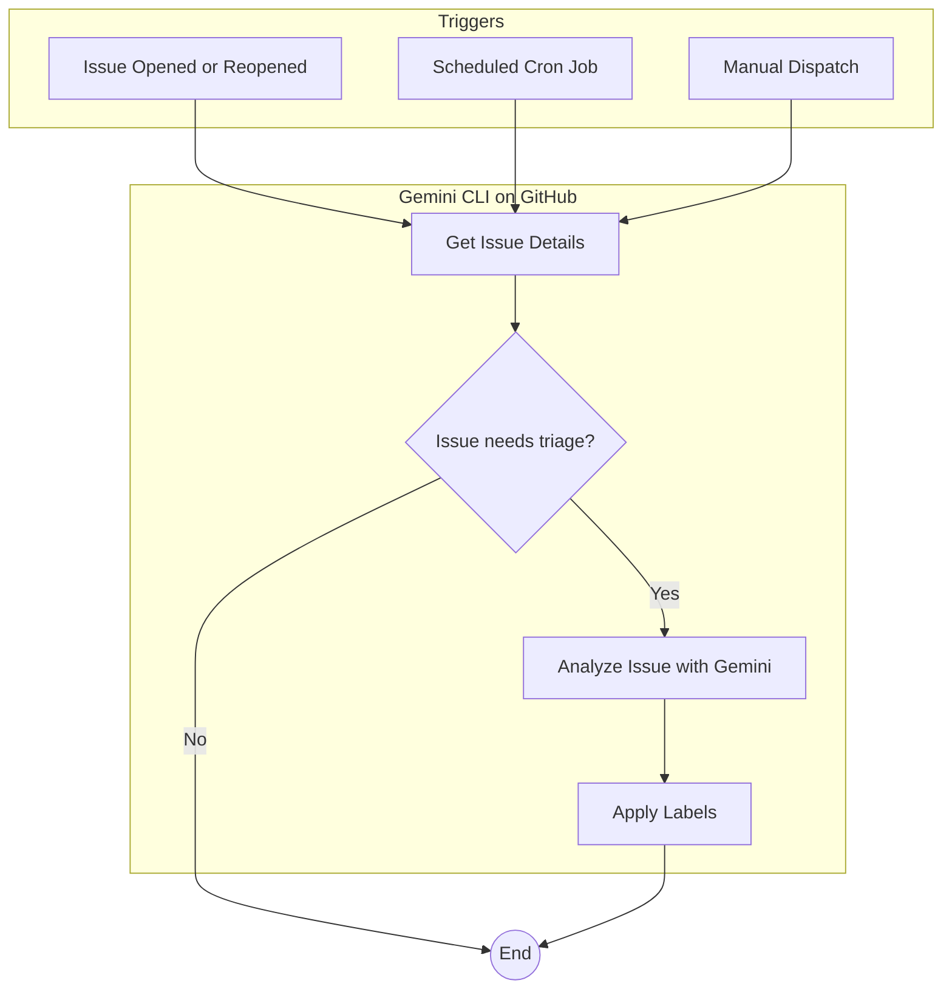

# Issue Triage Workflows

This document describes a comprehensive system for triaging GitHub issues using the Gemini CLI GitHub Action. This system consists of two complementary workflows: a real-time triage workflow and a scheduled triage workflow.

- [Issue Triage Workflows](#issue-triage-workflows)
  - [How it Works](#how-it-works)
  - [Implementation](#implementation)
  - [Workflows in Detail](#workflows-in-detail)
    - [Real-Time Issue Triage](#real-time-issue-triage)
    - [Scheduled Issue Triage](#scheduled-issue-triage)

## How it Works

The two workflows work together to ensure that all new and existing issues are triaged in a timely manner.

1.  **Real-Time Triage**: When a new issue is opened or reopened, a GitHub Actions workflow is triggered. This workflow uses the Gemini CLI to analyze the issue and apply the most appropriate labels. This provides immediate feedback and categorization of new issues.

2.  **Scheduled Triage**: To catch any issues that might have been missed by the real-time triage, a scheduled workflow runs every hour. This workflow specifically looks for issues that have no labels or have the `status/needs-triage` label. This ensures that all issues are eventually triaged.

## Implementation

To implement this issue triage system in your repository, you will need to do the following:

1.  **Create the Workflows**: Copy the example workflow files into your repository's `.github/workflows` directory.

    *   `examples/gemini-issue-automated-triage.yml`
    *   `examples/gemini-issue-scheduled-triage.yml`

2.  **Configure Secrets**: The workflows require secrets for authentication. You will need to create the following secrets in your repository's settings:

    *   `APP_ID`: The ID of your GitHub App.
    *   `APP_PRIVATE_KEY`: The private key of your GitHub App.
    *   `GEMINI_API_KEY`: Your API key for the Gemini API.

3.  **Customize (Optional)**: You can customize the prompts and settings in the workflow files to suit your specific needs. For example, you can change the triage logic, the labels that are applied, or the schedule of the scheduled triage.

## Workflows in Detail

### Real-Time Issue Triage

This workflow is defined in `examples/gemini-issue-automated-triage.yml` and is triggered when an issue is opened or reopened. It uses the Gemini CLI to analyze the issue and apply relevant labels.

### Scheduled Issue Triage

This workflow is defined in `examples/gemini-issue-scheduled-triage.yml` and runs on a schedule (e.g., every hour). It finds any issues that have no labels or have the `status/needs-triage` label and then uses the Gemini CLI to triage them. This workflow can also be manually triggered.
