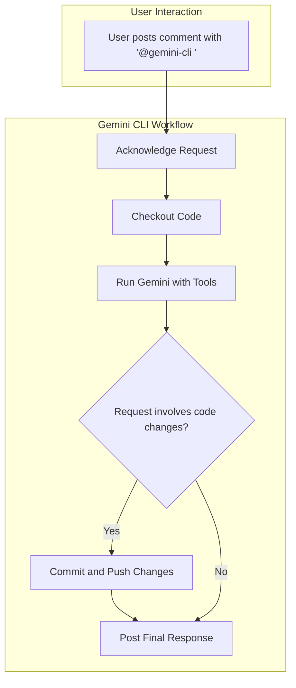

# Gemini CLI on GitHub

This document explains how to use the Gemini CLI on GitHub, a general-purpose, conversational AI assistant that can be invoked within pull requests and issues to perform a wide range of tasks.

- [Gemini CLI on GitHub](#gemini-cli-on-github)
  - [Overview](#overview)
  - [Features](#features)
  - [Setup](#setup)
    - [Prerequisites](#prerequisites)
    - [Workflow File](#workflow-file)
  - [Usage](#usage)
    - [Supported Triggers](#supported-triggers)
    - [How to Invoke](#how-to-invoke)
    - [Required Permissions](#required-permissions)
  - [Interaction Flow](#interaction-flow)
  - [Configuration](#configuration)
    - [Workflow Customization](#workflow-customization)
    - [Tool Customization](#tool-customization)
    - [Prompt Customization](#prompt-customization)
  - [Examples](#examples)
    - [Asking a Question](#asking-a-question)
    - [Requesting a Code Change](#requesting-a-code-change)
    - [Summarizing an Issue](#summarizing-an-issue)

## Overview

The Gemini CLI workflow provides a powerful, conversational AI assistant that can be triggered directly from comments in GitHub issues and pull requests. Unlike specialized workflows for reviews or triage, the general CLI is designed to handle a broad variety of requests, from answering questions about the code to performing complex code modifications.

When invoked with `@gemini-cli`, the assistant uses a customizable set of tools to understand the context, execute the user's request, and respond within the same thread.

## Features

- **Conversational Interface**: Interact with an AI assistant directly in issue and PR comments.
- **Repository Interaction**: Can read files, view diffs, and inspect issue details.
- **Code Modification**: Capable of writing to files, committing changes, and pushing to the branch.
- **Customizable Toolset**: Define exactly which shell commands and tools the AI is allowed to use.
- **Flexible Prompting**: Tailor the AI's role, instructions, and guidelines to fit your project's needs.

## Setup

### Prerequisites

1.  **Gemini API Key**: Required for AI functionality.
    -   Set `GEMINI_API_KEY` secret in your repository.
2.  **GitHub App Token (Optional)**: Required for authentication if using custom github app.
    -   Set `APP_ID` and `APP_PRIVATE_KEY` secrets in your repository.
3.  **Telemetry (Optional)**: For observability.
    -   Set `OTLP_GCP_WIF_PROVIDER` secret and `OTLP_GOOGLE_CLOUD_PROJECT` variable.

### Workflow File

Create the necessary directories and download the example workflow file into your repository's `.github/workflows` directory.

```bash
mkdir -p .github/workflows
curl -o .github/workflows/gemini-cli.yml https://raw.githubusercontent.com/google-github-actions/run-gemini-cli/main/workflows/gemini-cli/gemini-cli.yml
```
Alternatively, you can manually copy the contents of the workflow file from this repository into the corresponding file in your own repository.

## Usage

### Supported Triggers

The Gemini CLI workflow is triggered by new comments in:
- Pull Request reviews
- Pull Request review comments
- Issues

The workflow is intentionally configured *not* to respond to comments containing `/review` or `/triage` to avoid conflicts with other dedicated workflows.

### How to Invoke

To use the CLI, mention `@gemini-cli` in a comment, followed by your request:

```
@gemini-cli Please explain what the `main.go` file does.
```

```
@gemini-cli Refactor the `calculateTotal` function in `src/utils.js` to improve readability.
```

### Required Permissions

Only users with the following roles can trigger the workflow:
- Repository Owner (`OWNER`)
- Repository Member (`MEMBER`)
- Repository Collaborator (`COLLABORATOR`)

## Interaction Flow

The workflow follows a clear, multi-step process to handle requests.



1.  **Acknowledge**: The action first posts a brief comment to let the user know the request has been received.
2.  **Execute**: It runs the Gemini model, providing it with the user's request, repository context, and a set of tools.
3.  **Commit (if needed)**: If the AI uses tools to modify files, it will automatically commit and push the changes to the branch.
4.  **Respond**: The AI posts a final, comprehensive response as a comment on the issue or pull request.

## Configuration

The `gemini-cli.yml` workflow is highly customizable.

### Workflow Customization

You can modify the workflow file to:
- Adjust the `timeout-minutes` for long-running tasks.
- Change the trigger conditions or required user permissions.

### Tool Customization

The most powerful feature is the ability to define the tools the AI can use. In the `settings_json` input, you can edit the `coreTools` array to grant or revoke access to specific shell commands.

**Example: Adding the `ls` command**
```yaml
with:
  settings: |
    {
      "coreTools": [
        "run_shell_command(ls)",
        "run_shell_command(echo)",
        "run_shell_command(gh pr view)",
        # ... other tools
      ],
      # ... other settings
    }
```

### Prompt Customization

The system prompt, located in the `prompt` input, defines the AI's role and instructions. You can edit this prompt to:
- Change its persona or primary function.
- Add project-specific guidelines or context.
- Instruct it to format its output in a specific way.

## Examples

### Asking a Question
```
@gemini-cli What is the purpose of the `telemetry.js` script?
```

### Requesting a Code Change
```
@gemini-cli In `package.json`, please add a new script called "test:ci" that runs `npm test`.
```

### Summarizing an Issue
```
@gemini-cli Can you summarize the main points of this issue thread for me?
```
