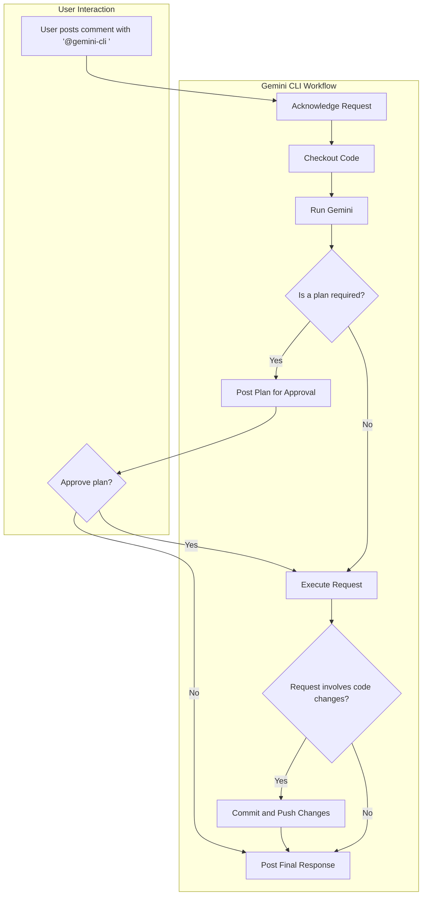

# General Gemini CLI Workflow on GitHub

In this guide you will learn how to use the general Gemini CLI workflow via GitHub Actions. This workflow serves as a general-purpose and conversational AI assistant that can be invoked directly in GitHub Pull Request and Issue comments to perform a wide range of tasks. When you invoke the general Gemini CLI workflow via `@gemini-cli`, the AI assistant uses a customizable set of tools to understand the context, execute the user's request, and respond within the same thread.

**Note:** Unlike specialized Gemini CLI workflows for [pull request reviews](../pr-review) or [issue triage](../issue-triage), the general CLI is designed to handle a broad variety of requests, from answering questions about the code to performing complex code modifications, as demonstrated further in this document.

- [Gemini CLI on GitHub](#gemini-cli-on-github)
  - [Overview](#overview)
  - [Features](#features)
  - [Setup](#setup)
    - [Prerequisites](#prerequisites)
    - [Workflow File](#workflow-file)
  - [Usage](#usage)
    - [Supported Triggers](#supported-triggers)
    - [How to Invoke](#how-to-invoke)
    - [Required Permissions](#required-permissions)
  - [Interaction Flow](#interaction-flow)
  - [Configuration](#configuration)
    - [Workflow Customization](#workflow-customization)
    - [Tool Customization](#tool-customization)
    - [Prompt Customization](#prompt-customization)
  - [Examples](#examples)
    - [Asking a Question](#asking-a-question)
    - [Requesting a Code Change](#requesting-a-code-change)
    - [Summarizing an Issue](#summarizing-an-issue)

## General Gemini CLI Workflow Features

- **Conversational Interface**: You can interact with the Gemini AI assistant directly in GitHub Issue and PR comments.
- **Repository Interaction**: The Gemini CLI can read files, view diffs in Pull Requests, and inspect Issue details.
- **Code Modification**: The Gemini CLI is capable of writing to files, committing changes, and pushing to the branch.
- **Customizable Toolset**: You can define exactly which shell commands and tools the Gemini AI is allowed to use.
- **Flexible Prompting**: You can tailor the Gemini CLI's role, instructions, and guidelines to fit your project's needs.

## Setup

For detailed setup instructions, including prerequisites and authentication, please refer to the main [Getting Started](../../README.md#getting-started) and [Configuration](../../README.md#configuration) documentation.

To use this workflow, copy the `gemini-cli.yml` file into your repository's `.github/workflows` directory:

```bash
mkdir -p .github/workflows
curl -o .github/workflows/gemini-cli.yml https://raw.githubusercontent.com/google-github-actions/run-gemini-cli/main/workflows/gemini-cli/gemini-cli.yml
```

## Usage

### Supported Triggers

The general Gemini CLI workflow is triggered by new comments in:

- GitHub Pull Request reviews
- GitHub Pull Request review comments
- GitHub Issues

The general Gemini CLI workflow is intentionally configured *not* to respond to comments containing `/review` or `/triage` to avoid conflicts with other dedicated workflows (such as [the Gemini CLI Pull Request workflow](../pr-review) or [the issue triage workflow](../issue-triage)).

### How to Invoke the Gemini CLI Workflow

To use the general GitHub CLI workflow, just mention `@gemini-cli` in a comment in a GitHub Pull Request or an Issue, followed by your request. For example:

```
@gemini-cli Please explain what the `main.go` file does.
```

```
@gemini-cli Refactor the `calculateTotal` function in `src/utils.js` to improve readability.
```

### Required Permissions

Only users with the following roles can trigger the workflow:

- Repository Owner (`OWNER`)
- Repository Member (`MEMBER`)
- Repository Collaborator (`COLLABORATOR`)

## Interaction Flow

The workflow follows a clear, multi-step process to handle requests:



1.  **Acknowledge**: The action first posts a brief comment to let the user know the request has been received.
2.  **Plan (if needed)**: For requests that may involve code changes or complex actions, the AI will first create a step-by-step plan. It will post this plan as a comment and wait for the user to approve it by replying with `@gemini-cli plan#123 approved`. This ensures the user has full control before any changes are made.
3.  **Execute**: Once the plan is approved (or if no plan was needed), it runs the Gemini model, providing it with the user's request, repository context, and a set of tools.
4.  **Commit (if needed)**: If the AI uses tools to modify files, it will automatically commit and push the changes to the branch.
5.  **Respond**: The AI posts a final, comprehensive response as a comment on the issue or pull request.

## Configuration

The `gemini-cli.yml` workflow file is highly customizable.

### Workflow Customization

You can modify the workflow file to:

- Adjust the `timeout-minutes` for long-running tasks.
- Change the trigger conditions or required user permissions.

### Tool Customization

One of the most powerful features of the Gemini CLI GitHub Action workflow is the ability to define the tools in the `gemini-cli.yml` workflow file that the Gemini AI can use.

For example, in `gemini-cli.yml` in the `settings_json` input, you can edit the `coreTools` array to grant or revoke access to specific shell commands:

**Example: Adding the `ls` command**

```yaml
...
with:
  settings: |
    {
      "coreTools": [
        "run_shell_command(ls)",
        "run_shell_command(echo)",
        "run_shell_command(gh pr view)",
        # ... other tools
      ],
      # ... other settings
    }
...
```

### Prompt Customization

The Gemini CLI system prompt, located in the `prompt` input, defines the Gemini AI's role and instructions. You can edit this prompt to, for example:

- Change its persona or primary function.
- Add project-specific guidelines or context.
- Instruct it to format its output in a specific way.

## Examples

More general Gemini CLI workflow examples:

### Asking a Question

```
@gemini-cli What is the purpose of the `telemetry.js` script?
```

### Requesting a Code Change

```
@gemini-cli In `package.json`, please add a new script called "test:ci" that runs `npm test`.
```

### Summarizing an Issue

```
@gemini-cli Can you summarize the main points of this issue thread for me?
```

[Google AI Studio]: https://aistudio.google.com/apikey
