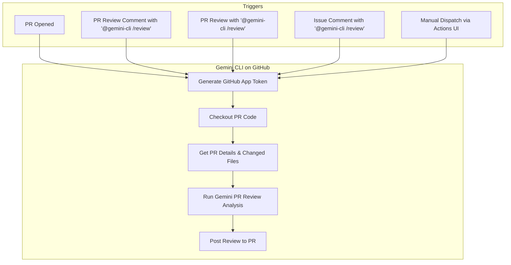

# PR Review with Gemini CLI

This document explains how to use the Gemini CLI on GitHub to automatically review pull requests with AI-powered code analysis.

- [PR Review with Gemini CLI](#pr-review-with-gemini-cli)
  - [Overview](#overview)
  - [Features](#features)
  - [Setup](#setup)
    - [Prerequisites](#prerequisites)
    - [Workflow File](#workflow-file)
  - [Usage](#usage)
    - [Supported Triggers](#supported-triggers)
    - [Automatic Reviews](#automatic-reviews)
    - [Manual Reviews](#manual-reviews)
    - [Custom Review Instructions](#custom-review-instructions)
    - [Manual Workflow Dispatch](#manual-workflow-dispatch)
  - [Review Output Format](#review-output-format)
    - [📋 Review Summary](#-review-summary)
    - [🔍 General Feedback](#-general-feedback)
    - [🎯 Specific Feedback](#-specific-feedback)
    - [✅ Highlights](#-highlights)
  - [Review Areas](#review-areas)
  - [Configuration](#configuration)
    - [Workflow Customization](#workflow-customization)
    - [Review Prompt Customization](#review-prompt-customization)
  - [Examples](#examples)
    - [Basic Review Request](#basic-review-request)
    - [Security-Focused Review](#security-focused-review)
    - [Performance Review](#performance-review)
    - [Breaking Changes Check](#breaking-changes-check)

## Overview

The PR Review workflow uses Google's Gemini AI to provide comprehensive code reviews for pull requests. It analyzes code quality, security, performance, and maintainability while providing constructive feedback in a structured format.

## Features

- **Automated PR Reviews**: Triggered on PR creation, updates, or manual requests
- **Comprehensive Analysis**: Covers security, performance, reliability, maintainability, and functionality
- **Priority-based Feedback**: Issues categorized by severity (Critical, High, Medium, Low)
- **Positive Highlights**: Acknowledges good practices and well-written code
- **Custom Instructions**: Support for specific review focus areas
- **Structured Output**: Consistent markdown format for easy reading

## Setup

### Prerequisites

1. **GitHub App Token**: Required for authentication
   - Set `APP_ID` and `APP_PRIVATE_KEY` secrets in your repository
2. **Gemini API Key**: Required for AI functionality
   - Set `GEMINI_API_KEY` secret in your repository
3. **Telemetry (Optional)**: For observability
   - Set `OTLP_GCP_WIF_PROVIDER` secret and `OTLP_GOOGLE_CLOUD_PROJECT` variable

### Workflow File

Create the necessary directories and download the example workflow file into your repository's `.github/workflows` directory.

```bash
mkdir -p .github/workflows
curl -o .github/workflows/gemini-pr-review.yml https://raw.githubusercontent.com/google-github-actions/run-gemini-cli/main/workflows/pr-review/gemini-pr-review.yml
```
Alternatively, you can manually copy the contents of the workflow file from this repository into the corresponding file in your own repository.

## Usage

### Supported Triggers

The Gemini PR Review workflow is triggered by:

- **New PRs**: When a pull request is opened
- **PR Review Comments**: When a review comment contains `@gemini-cli /review`
- **PR Reviews**: When a review body contains `@gemini-cli /review`
- **Issue Comments**: When a comment on a PR contains `@gemini-cli /review`
- **Manual Dispatch**: Via the GitHub Actions UI ("Run workflow")



### Automatic Reviews

The workflow automatically triggers on:
- **New PRs**: When a pull request is opened

### Manual Reviews

Trigger a review manually by commenting on a PR:

```
@gemini-cli /review
```

**Required Permissions**: Only users with the following roles can trigger manual reviews:
- Repository Owner
- Repository Member  
- Repository Collaborator

### Custom Review Instructions

You can provide specific focus areas by adding instructions after the trigger:

```
@gemini-cli /review focus on security
@gemini-cli /review check performance and memory usage  
@gemini-cli /review please review error handling
@gemini-cli /review look for breaking changes
```

### Manual Workflow Dispatch

You can also trigger reviews through the GitHub Actions UI:
1. Go to Actions tab in your repository
2. Select "Gemini PR Review" workflow
3. Click "Run workflow"
4. Enter the PR number to review

## Review Output Format

The AI review follows a structured format:

### 📋 Review Summary
Brief 2-3 sentence overview of the PR and overall assessment.

### 🔍 General Feedback  
- Overall code quality observations
- Architectural patterns and decisions
- Positive implementation aspects
- Recurring themes across files

### 🎯 Specific Feedback
Priority-based issues (only shown if issues exist):

**🔴 Critical**: Security vulnerabilities, breaking changes, major bugs that must be fixed before merging

**🟡 High**: Performance problems, design flaws, significant bugs that should be addressed

**🟢 Medium**: Code quality improvements, style issues, minor optimizations, better practices

**🔵 Low**: Nice-to-have improvements, documentation suggestions, minor refactoring

### ✅ Highlights
- Well-implemented features and good practices
- Quality code sections worth acknowledging  
- Improvements from previous versions

## Review Areas

Gemini CLI analyzes multiple dimensions of code quality:

- **Security**: Authentication, authorization, input validation, data sanitization
- **Performance**: Algorithms, database queries, caching, resource usage
- **Reliability**: Error handling, logging, testing coverage, edge cases
- **Maintainability**: Code structure, documentation, naming conventions
- **Functionality**: Logic correctness, requirements fulfillment

## Configuration

### Workflow Customization

You can customize the workflow by modifying:

- **Timeout**: Adjust `timeout-minutes` for longer reviews
- **Triggers**: Modify when the workflow runs
- **Permissions**: Adjust who can trigger manual reviews
- **Core Tools**: Add or remove available shell commands

### Review Prompt Customization

The AI prompt can be customized to:
- Focus on specific technologies or frameworks
- Emphasize particular coding standards
- Include project-specific guidelines
- Adjust review depth and focus areas

## Examples

### Basic Review Request
```
@gemini-cli /review
```

### Security-Focused Review
```
@gemini-cli /review focus on security vulnerabilities and authentication
```

### Performance Review
```
@gemini-cli /review check for performance issues and optimization opportunities
```

### Breaking Changes Check
```
@gemini-cli /review look for potential breaking changes and API compatibility
```
